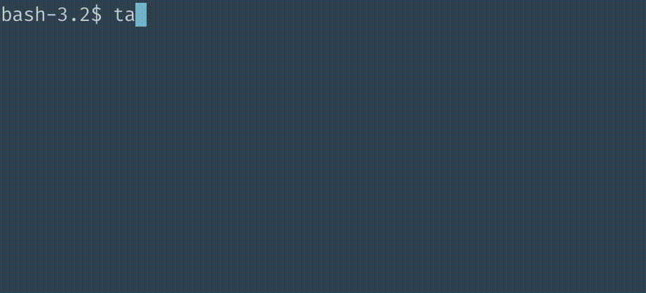

tangit
============

[](https://oclif.io)
[](https://npmjs.org/package/tangit)
[](https://npmjs.org/package/tangit)
[](https://opensource.org/licenses/MIT)

Runs the same git command in two repositories. Useful when working for example with a server repo and a client repo.



<!-- toc -->
* [Installation](#installation)
* [Usage](#usage)
* [Commands](#commands)

<!-- tocstop -->
# Installation
```sh-session
$ npm install -g tangit
```

# Usage
<!-- usage -->
```sh-session
$ npm install -g tangit
$ tangit COMMAND
running command...
$ tangit (-v|--version|version)
tangit/1.0.7 darwin-x64 node-v11.6.0
$ tangit --help [COMMAND]
USAGE
  $ tangit COMMAND
...
```
<!-- usagestop -->
# Commands
<!-- commands -->
* [`tangit checkout [BRANCH]`](#tangit-checkout-branch)
* [`tangit help [COMMAND]`](#tangit-help-command)
* [`tangit pull`](#tangit-pull)
* [`tangit status`](#tangit-status)

## `tangit checkout [BRANCH]`

Checkout branch in both repositories

```
USAGE
  $ tangit checkout [BRANCH]

OPTIONS
  -b, --branch=branch  Which branch to checkout. If branch does not exist, it will fallback to "master".
```

_See code: [src/commands/checkout.js](https://github.com/ang3lkar/tangit/blob/v1.0.7/src/commands/checkout.js)_

## `tangit help [COMMAND]`

display help for tangit

```
USAGE
  $ tangit help [COMMAND]

ARGUMENTS
  COMMAND  command to show help for

OPTIONS
  --all  see all commands in CLI
```

_See code: [@oclif/plugin-help](https://github.com/oclif/plugin-help/blob/v2.1.6/src/commands/help.ts)_

## `tangit pull`

```
USAGE
  $ tangit pull
```

_See code: [src/commands/pull.js](https://github.com/ang3lkar/tangit/blob/v1.0.7/src/commands/pull.js)_

## `tangit status`

Check branch in both repositories

```
USAGE
  $ tangit status
```

_See code: [src/commands/status.js](https://github.com/ang3lkar/tangit/blob/v1.0.7/src/commands/status.js)_
<!-- commandsstop -->

## Contributing
Pull requests are welcome. For major changes, please open an issue first to discuss what you would like to change.

Please make sure to update tests as appropriate.

## License
[MIT](https://choosealicense.com/licenses/mit/)
